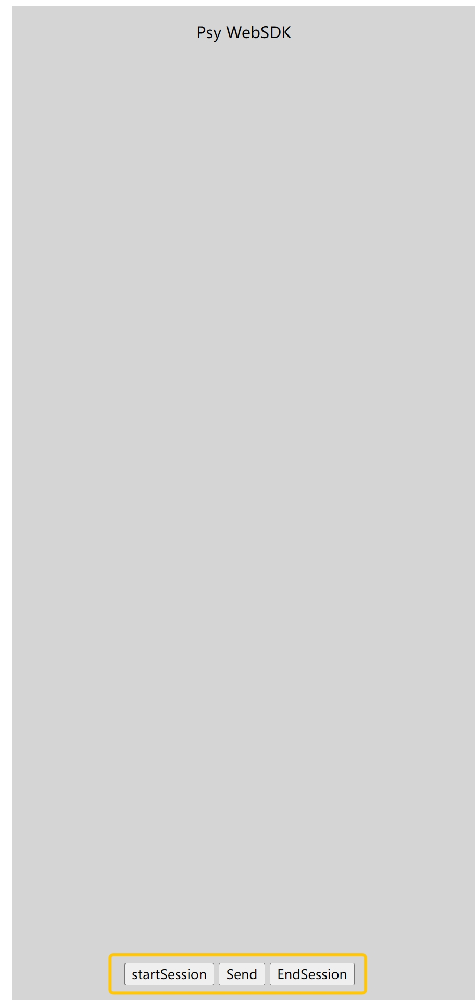

# WebSDKdemo 

2 D human WebSDK demo 

## usage


### flow
startSession -> send(replace with your own test content in index.html) -> stopSession (if necessary)

### update test content

```javascript
const testContent = ${yourOwnTestContent} 
```

## config
config the ak, sk and userId in index.html
```javascript
/* the following params are acquired from service provider, contact them if you don't have yet. */
const bywId = '0086*******1904'
const appKey = '*******'
const accessToken = '*******'
```

## build

```shell
npm i
```

## run

```shell
nodemon server.js
```

## test

open http://localhost:8081 in browser
